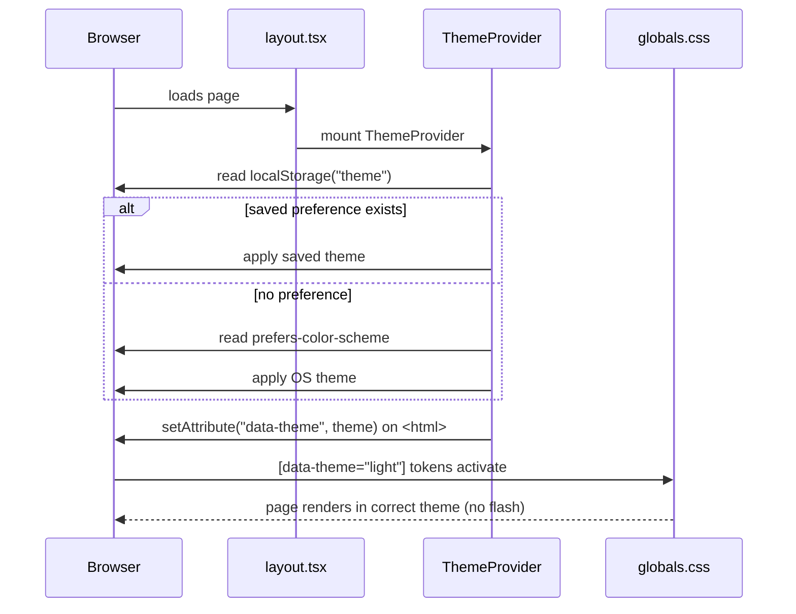
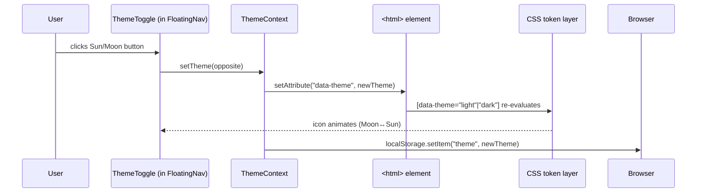

# Design Document: Dark / Light Mode Toggle

## Overview

Add a persistent dark/light mode toggle to the creative portfolio. The toggle lives in the
floating nav and flips the entire site between the existing **dark** aesthetic (green-on-near-black,
Matrix/cyber) and a new **light** aesthetic (same vivid green accents on a clean off-white canvas)
so every component remains vibrant and readable in both modes. Preference is stored in
`localStorage` and respects the OS `prefers-color-scheme` signal on first visit.

The portfolio currently uses **hardcoded inline `style` props** throughout — there are no Tailwind
`dark:` variants in play. The solution must work with that pattern by replacing magic hex literals
with CSS custom properties (design tokens) that switch atomically when a `data-theme` attribute
flips on `<html>`.

---

## Architecture

```mermaid
graph TD
    A[ThemeProvider<br/>React Context + localStorage] -->|provides useTheme()| B[FloatingNav]
    A -->|data-theme on html| C[globals.css token layer]
    B -->|renders| D[ThemeToggle button<br/>Sun / Moon icon]
    C -->|consumed by| E[All components via var\\(--token\\)]
    E --> F[page.tsx inline styles]
    E --> G[GlassmorphicCard]
    E --> H[ProjectCard]
    E --> I[SkillsTabbed / SkillCard]
    E --> J[Timeline]
    E --> K[ContactForm]
    E --> L[CertCard / SpecCard]
    E --> M[SectionHeading]
    E --> N[TechMarquee]
    E --> O[FloatingNav]
    E --> P[ScrollProgress / MouseFollower]
    E --> Q[CyberRoles]
```

---

## Sequence Diagrams

### Theme initialisation (first paint)



### Toggle interaction



---

## Components and Interfaces

### 1. ThemeProvider (`components/theme-provider.tsx`)

**Purpose**: Wraps the app, manages theme state, syncs to `<html data-theme>` and `localStorage`.

**Interface**:

```typescript
type Theme = "dark" | "light"

interface ThemeContextValue {
  theme: Theme
  setTheme: (t: Theme) => void
  toggleTheme: () => void
}

interface ThemeProviderProps {
  children: ReactNode
  defaultTheme?: Theme   // fallback before localStorage/OS check
}
```

**Responsibilities**:
- Read `localStorage("theme")` on mount; fall back to `window.matchMedia("prefers-color-scheme: dark")`
- Write `document.documentElement.setAttribute("data-theme", theme)` on every theme change
- Persist choice to `localStorage` so it survives page refresh
- Expose `useTheme()` hook for any descendant component
- Use `next-themes` (already in `package.json`) as the underlying engine — it handles SSR
  hydration, flash-of-wrong-theme prevention, and the `data-theme` attribute automatically

### 2. ThemeToggle (`components/theme-toggle.tsx`)

**Purpose**: Animated Sun/Moon icon button placed inside the FloatingNav desktop row and the
mobile full-screen menu.

**Interface**:

```typescript
interface ThemeToggleProps {
  className?: string
  style?: React.CSSProperties
}
```

**Responsibilities**:
- Calls `toggleTheme()` from `useTheme()` on click
- Renders `Sun` icon in dark mode (indicates "switch to light"), `Moon` in light mode
- Animates between icons with a `framer-motion` rotate + scale transition (matches existing
  `framer-motion` usage in the project)
- Accessible: `aria-label="Switch to light mode"` / `"Switch to dark mode"`

### 3. CSS Token Layer (`app/globals.css`)

**Purpose**: Single source of truth for every theme-sensitive colour. Components reference
`var(--token)` instead of raw hex values.

**Responsibilities**:
- `:root` / `[data-theme="dark"]` block defines the dark palette (existing colours)
- `[data-theme="light"]` block defines the light palette
- All existing custom properties (`--green`, `--bg`, `--surface`, `--border`, `--text`,
  `--text-dim`, etc.) are preserved — values change per theme, names stay identical
- Additional tokens added for surfaces that behave differently in light mode:
  `--nav-bg`, `--card-bg`, `--card-border`, `--input-bg`, `--icon-filter`
- Tailwind `dark:` class strategy is **not** used; token switching is purely via `data-theme`
- Transition rule: `html { transition: background-color 0.25s ease, color 0.25s ease; }`
  applied to `body` and key tokens so the switch feels smooth

### 4. FloatingNav (modified — `components/floating-nav.tsx`)

**Purpose**: Host the ThemeToggle button in the existing nav bar.

**Changes**:
- Import `ThemeToggle` and render it to the right of the "Hire Me" button on desktop
- Render it at the bottom of the mobile full-screen menu
- Nav background (`rgba(3,8,3,0.96)` dark → `rgba(250,252,250,0.96)` light) pulled from
  `var(--nav-bg)` token

---

## Data Models

### Token Palette — Dark Mode

```typescript
// Existing values, mapped to CSS custom properties
interface DarkPalette {
  "--green":        "#00ff41"
  "--green-dim":    "#00cc33"
  "--green-mid":    "rgba(0,255,65,0.55)"
  "--green-glow":   "rgba(0,255,65,0.18)"
  "--green-glow2":  "rgba(0,255,65,0.05)"
  "--bg":           "#030703"       // page background
  "--surface":      "rgba(0,255,65,0.035)"   // card fill
  "--border":       "rgba(0,255,65,0.11)"
  "--border-hot":   "rgba(0,255,65,0.32)"
  "--text":         "#e4ffe4"       // primary text
  "--text-dim":     "rgba(228,255,228,0.48)"
  "--text-muted":   "rgba(228,255,228,0.22)"
  "--nav-bg":       "rgba(3,8,3,0.96)"
  "--card-bg":      "rgba(0,255,65,0.025)"
  "--card-border":  "rgba(0,255,65,0.11)"
  "--input-bg":     "rgba(0,255,65,0.03)"
  "--icon-filter":  "brightness(0) invert(1) sepia(1) saturate(3) hue-rotate(80deg) brightness(0.75)"
  "--scrollbar-thumb": "#00aa22"
}
```

### Token Palette — Light Mode

```typescript
// New values — same green accents on bright canvas
interface LightPalette {
  "--green":        "#00b32d"       // slightly deeper for contrast on white
  "--green-dim":    "#008f24"
  "--green-mid":    "rgba(0,179,45,0.65)"
  "--green-glow":   "rgba(0,179,45,0.20)"
  "--green-glow2":  "rgba(0,179,45,0.07)"
  "--bg":           "#f4f9f4"       // soft off-white with green tint
  "--surface":      "rgba(0,179,45,0.05)"
  "--border":       "rgba(0,179,45,0.16)"
  "--border-hot":   "rgba(0,179,45,0.45)"
  "--text":         "#0d1f0d"       // near-black with green hue
  "--text-dim":     "rgba(13,31,13,0.65)"
  "--text-muted":   "rgba(13,31,13,0.38)"
  "--nav-bg":       "rgba(244,249,244,0.96)"
  "--card-bg":      "rgba(0,179,45,0.04)"
  "--card-border":  "rgba(0,179,45,0.15)"
  "--input-bg":     "rgba(0,179,45,0.04)"
  "--icon-filter":  "brightness(0) saturate(100%) invert(35%) sepia(60%) saturate(500%) hue-rotate(100deg)"
  "--scrollbar-thumb": "#00a020"
}
```

**Design rationale for light palette**:
- `--green` shifts to `#00b32d` (darker green) to maintain WCAG AA contrast ratio ≥ 4.5:1
  against the `#f4f9f4` background (contrast ratio ≈ 6.1:1)
- Background is not pure white — the subtle green tint keeps the "cyber garden" feel
- Text is near-black `#0d1f0d` (not pure `#000`) to avoid harsh contrast while staying crisp
- All `rgba(0,255,65,…)` values are remapped to `rgba(0,179,45,…)` so glow, border, and
  surface tints remain proportionally vivid rather than washed out

---

## Component-Level Light Mode Adaptations

### Inline styles → CSS variable migration strategy

Most components use patterns like:
```typescript
style={{ color: '#00ff41', background: 'rgba(0,255,65,0.03)' }}
```

These are replaced with:
```typescript
style={{ color: 'var(--green)', background: 'var(--card-bg)' }}
```

The following table maps the most common raw values to their token equivalents:

| Raw value (dark)              | CSS token        | Notes                          |
|-------------------------------|------------------|--------------------------------|
| `#00ff41`                     | `var(--green)`   | Primary accent                 |
| `rgba(0,255,65,0.55)`         | `var(--green-dim)` | Secondary accent             |
| `#e8ffe8`, `#e4ffe4`          | `var(--text)`    | Primary text                   |
| `rgba(232,255,232,0.5)`       | `var(--text-dim)` | Body copy                     |
| `rgba(232,255,232,0.25)`      | `var(--text-muted)` | Labels / metadata           |
| `rgba(0,255,65,0.035)`        | `var(--surface)` | Card fill                      |
| `rgba(0,255,65,0.03)`         | `var(--card-bg)` | Form / card input fill         |
| `rgba(0,255,65,0.11)`         | `var(--border)`  | Default border                 |
| `rgba(0,255,65,0.32)`         | `var(--border-hot)` | Hover border                |
| `#030703`, `#050a05`          | `var(--bg)`      | Page / section background      |
| `rgba(3,8,3,0.96)`            | `var(--nav-bg)`  | Nav pill background            |

### Special components

**TechMarquee** — icon `filter` CSS uses raw brightness/hue-rotate values that assume dark bg.
Replaced with `filter: var(--icon-filter)` so icons stay visible on light bg.

**ScrollProgress** — gradient stays green (`#00cc33` → `#00ff41`); these are accent-only so they
work in both modes without change.

**MouseFollower** — border `rgba(0,255,65,0.5)` → `var(--border-hot)`; dot `#00ff41` → `var(--green)`.

**CyberRoles orbital** — ring fills and chip backgrounds use surface/border tokens. The pulsing
`boxShadow` glows reference `var(--green-glow)`.

**body::before noise texture** — opacity reduced from 0.3 to 0.15 in light mode (less intrusive
on a bright background) via `[data-theme="light"] body::before { opacity: 0.15; }`.

**scanline** — hidden in light mode: `[data-theme="light"] .scanline { display: none; }`.

**Grid background** — `.grid-bg` uses `rgba(0,255,65,0.04)` lines; in light mode maps to
`rgba(0,179,45,0.07)` (slightly stronger to stay visible on pale bg).

---

## Error Handling

### Flash of Wrong Theme (FOUT)

**Condition**: SSR renders with default theme before client JS runs, causing a visible flash.  
**Response**: `next-themes` injects a blocking `<script>` before page paint that reads
`localStorage` and sets `data-theme` synchronously — eliminating FOUT.  
**Recovery**: If `localStorage` is unavailable (SSR, privacy mode) the OS preference is used.

### localStorage Unavailable

**Condition**: Private browsing or storage quota exceeded.  
**Response**: `try/catch` around all `localStorage` calls; fall back to in-memory state.  
**Recovery**: Theme still toggles correctly within the session; no error is surfaced to the user.

### Hydration Mismatch

**Condition**: Server renders "dark" but client immediately switches to "light" before React
reconciles, causing a hydration warning.  
**Response**: `next-themes` handles this via `suppressHydrationWarning` on `<html>` and deferred
class application. Components that depend on theme use the `mounted` guard pattern:

```typescript
const [mounted, setMounted] = useState(false)
useEffect(() => setMounted(true), [])
if (!mounted) return null  // or a skeleton
```

---

## Testing Strategy

### Unit Testing Approach

- `ThemeProvider` initialises to OS preference when `localStorage` is empty
- `ThemeProvider` respects stored `localStorage` value over OS preference
- `toggleTheme()` flips `"dark"` → `"light"` and `"light"` → `"dark"`
- `ThemeToggle` renders `Sun` icon when theme is `"dark"`; `Moon` icon when `"light"`
- `ThemeToggle` calls `toggleTheme` on click

### Property-Based Testing Approach

**Property Test Library**: fast-check

```typescript
// Property: toggling twice always returns to the original theme
fc.property(fc.constantFrom("dark", "light"), (initial) => {
  const { result } = renderHook(() => useTheme(), { wrapper: makeProvider(initial) })
  act(() => result.current.toggleTheme())
  act(() => result.current.toggleTheme())
  expect(result.current.theme).toBe(initial)
})

// Property: theme is always either "dark" or "light", never anything else
fc.property(fc.nat(100), (_n) => {
  const theme = result.current.theme
  expect(["dark", "light"]).toContain(theme)
})
```

### Integration Testing Approach

- Verify `<html data-theme="light">` attribute is set after toggle
- Verify `localStorage.getItem("theme")` matches active theme after toggle
- Verify computed CSS variables change value when `data-theme` attribute switches
- Verify no hydration errors in Next.js SSR render (using `@testing-library/react` + `renderToString`)

### Visual / Accessibility

- Contrast ratio of `var(--green)` on `var(--bg)` ≥ 4.5:1 in both modes (WCAG AA)
- Toggle button has visible focus ring in both modes
- Toggle is keyboard operable (Enter/Space)

---

## Performance Considerations

- CSS custom property switching is handled entirely by the browser's style engine — zero JS
  on the hot path after initial hydration
- `next-themes` script is ~400 bytes minified and runs synchronously before paint (no layout shift)
- No additional re-renders triggered by theme change beyond components that explicitly call
  `useTheme()` (only `ThemeToggle` and `FloatingNav` need to)
- Framer Motion `AnimatePresence` for the icon swap adds no measurable overhead (single icon swap)

---

## Correctness Properties

*A property is a characteristic or behavior that should hold true across all valid executions of a system — essentially, a formal statement about what the system should do. Properties serve as the bridge between human-readable specifications and machine-verifiable correctness guarantees.*

### Property 1: Theme persistence round-trip

*For any* theme value that the ThemeProvider applies, reading `localStorage` immediately after the
change must return that exact same theme value.

**Validates: Requirements 1.3**

---

### Property 2: Toggle is an involution (double-toggle identity)

*For any* starting theme value (`"dark"` or `"light"`), calling `toggleTheme()` twice in succession
must return the theme to its original value.

**Validates: Requirements 2.5**

---

### Property 3: ThemeToggle icon and aria-label are consistent with active theme

*For any* theme value in `{"dark", "light"}`, the ThemeToggle must display the correct icon
(Sun when dark, Moon when light) and the correct `aria-label` (`"Switch to light mode"` when dark,
`"Switch to dark mode"` when light). The Moon icon must never appear when the theme is `"dark"`.

**Validates: Requirements 2.3, 2.4, 2.7, 6.4**

---

## Security Considerations

- `localStorage` stores only `"dark"` or `"light"` string literals; input is validated before use
- No user-supplied content is ever written to the DOM via the theme system
- The blocking script injected by `next-themes` is static and trusted

---

## Dependencies

| Package        | Already in project | Role                                         |
|----------------|--------------------|----------------------------------------------|
| `next-themes`  | ✅ Yes (`latest`)  | SSR-safe theme provider, FOUT prevention     |
| `framer-motion`| ✅ Yes (`latest`)  | Icon swap animation in ThemeToggle           |
| `lucide-react` | ✅ Yes (`^0.454`)  | `Sun` and `Moon` icons for the toggle button |

No new dependencies required.
