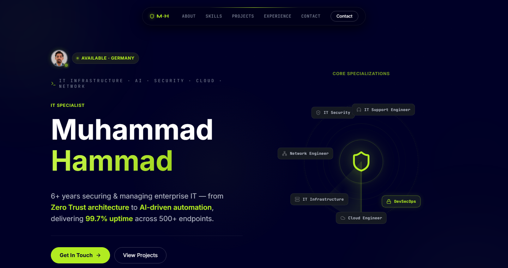

# muhammadhammad.vercel.app

Personal site for **Muhammad Hammad**, an IT infrastructure and security
engineer in Germany. It is one statically rendered page with interactive
diagrams for each specialisation, a skills matrix, project and certification
cards, and a work timeline.

**Live:** [muhammadhammad.vercel.app](https://muhammadhammad.vercel.app)


[](https://github.com/Muhammadhammad24/portfolio/actions/workflows/ci.yml)



## What's inside

| Component | What it does |
| --- | --- |
| `cyber-roles` | Orbital diagram of core specialisations, animated with Framer Motion |
| `skills-hex` | Hexagonal skills grid, grouped by domain |
| `tech-marquee` | Scrolling stack bar with 100+ SVG logos, pauses on hover |
| `timeline` | Work history with a magnetic-tilt card effect (`use-magnetic-tilt`) |
| `cert-card`, `project-card` | Certifications and project showcases |
| `floating-nav`, `scroll-progress` | Section navigation and reading progress |

The page is prerendered at build time and served from Vercel's edge, and the
tech-stack logos are local SVGs.

## Development

```bash
npm ci
npm run dev        # http://localhost:3000
npm run typecheck
npm run lint
npm run build
```

## Structure

```
app/
  layout.tsx       metadata, fonts, favicon
  page.tsx         all sections
  globals.css      theme tokens
components/        one file per section or widget
hooks/             use-magnetic-tilt, use-mobile
public/icons/      tech-stack SVGs
```
